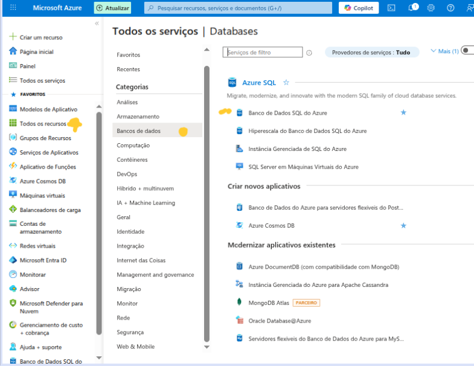
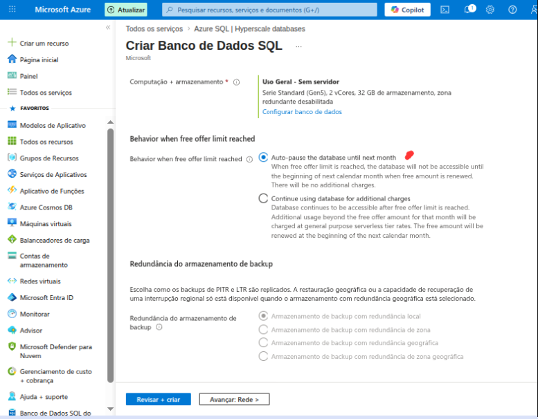
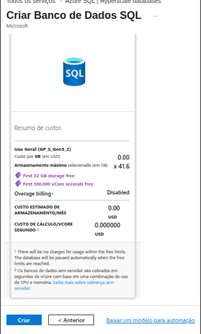
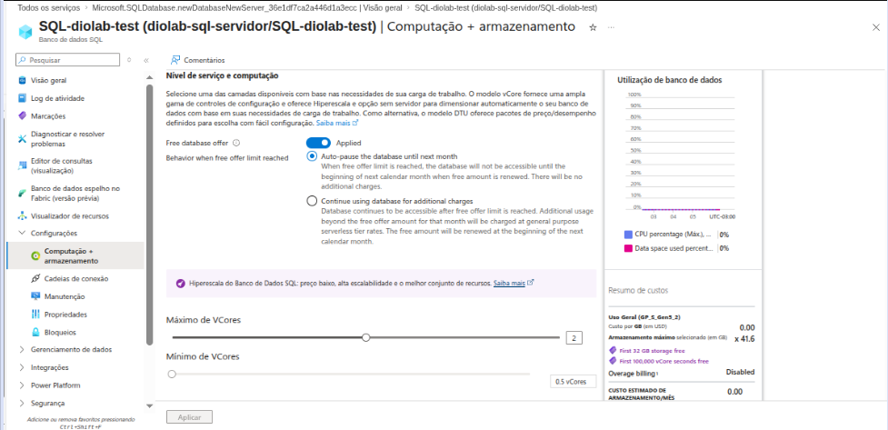
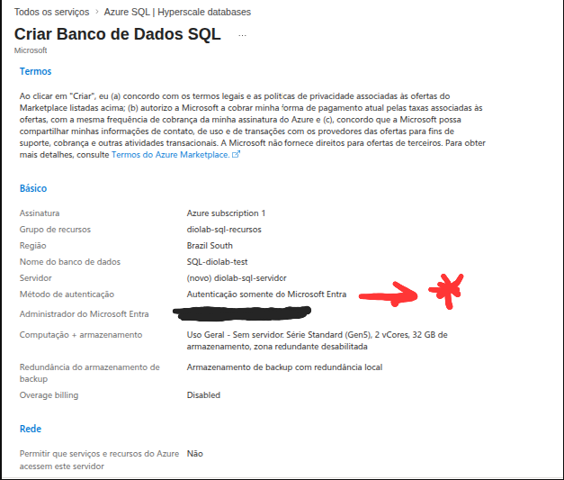
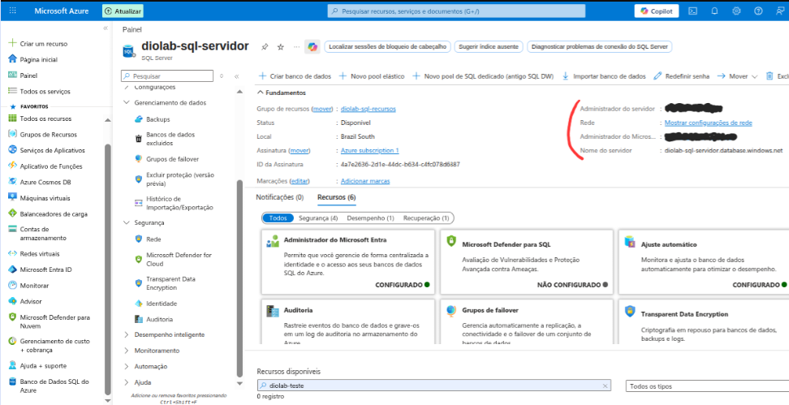
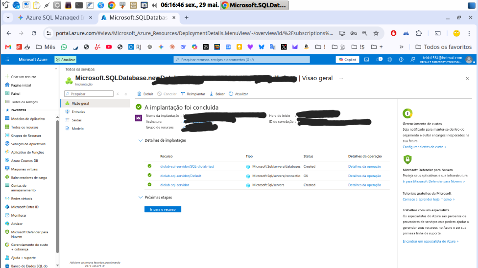
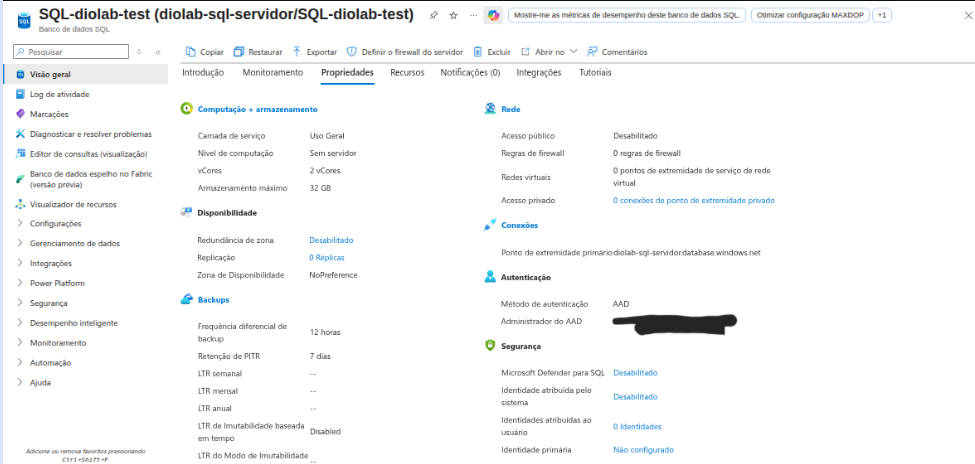
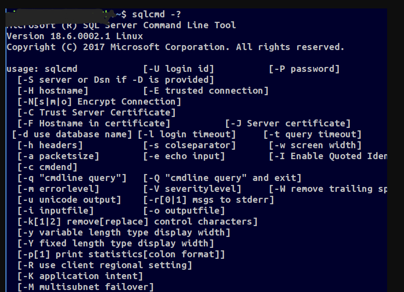
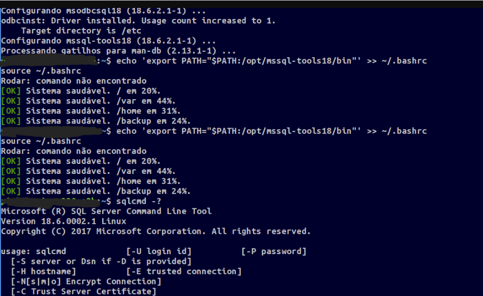

# Azure SQL Database: Meu Guia Prático de Arquitetura, Configuração e Conectividade via Linux

Desenvolvi este repositório como parte de um laboratório prático com o objetivo de explorar, configurar e documentar uma instância de banco de dados relacional na plataforma **Microsoft Azure**.

Estruturei este projeto a partir de um **único computador de estudos com recursos de hardware limitados, rodando uma distribuição Linux rodando de uma pendrive como minha estação de trabalho**, para utilizar a base de dados relacional robusta e corporativa na nuvem Azure, suportando meus pequenos projetos, automações residenciais ou scripts locais de análise de dados.
O conteúdo que apresento aqui serve como apoio para meus estudos de administração de infraestrutura em nuvem.

## Objetivos de Aprendizagem

* [x] Entender a arquitetura e posicionamento da família de produtos Azure SQL.
* [x] Aplicar conceitos de computação em nuvem (PaaS e Serverless) em um ambiente prático.
* [x] Configurar regras rígidas de segurança, redes e firewalls no ecossistema Azure.
* [x] Estabelecer conexões seguras e estáveis utilizando meu terminal Linux.
* [x] Praticar a engenharia de documentação técnica clara, estruturada e autoexplicativa.

---

## 📂 Estrutura do Repositório

```text
├── imagens/               # Capturas de tela das etapas de configuração no portal Azure
├── README.md             # Documentação principal e meu guia de estudos do laboratório
```

## Arquitetura e Configuração do Azure SQL

O ambiente de dados moderno exige flexibilidade, resiliência e segurança. Abaixo, documento os fundamentos teóricos e o passo a passo operacional que segui para provisionamento e consumo do Azure SQL Database.

## 1. O que é o Azure SQL e sua Finalidade

O Azure SQL é uma família de produtos de banco de dados relacionais em nuvem baseados no mecanismo de alta performance do Microsoft SQL Server. Classificado estritamente na categoria de PaaS (Plataforma como Serviço), ele foi desenhado para eliminar a complexidade da gestão de infraestrutura física e de sistemas operacionais.

Minha principal finalidade ao utilizá-lo é permitir que eu **foque exclusivamente no valor de negócio**: modelagem de dados, otimização de queries, indexação e lógica de negócios, delegando rotinas complexas de hardware, patch e rede à Microsoft.

## 2. Vantagens Estruturais do Modelo PaaS

**Gerenciamento Automatizado:** Rotinas críticas como backups (com retenção customizável), atualizações do engine do SQL Server e aplicação de patches de segurança ocorrem de forma transparente e sem downtime.

**Escalabilidade Elástica:** Capacidade de escalar recursos de computação (vCores) e armazenamento sob demanda para suportar picos de carga de trabalho, retornando ao estado inicial sem interrupção dos serviços.

**Camada Serverless:** Abordagem altamente eficiente em custos onde os recursos computacionais são faturados estritamente por segundo de uso ativo. Inclui o recurso de Pausa Automática, que suspende o banco de dados durante períodos de inatividade que defini.

**Segurança Avançada e Integrada:** Proteção em multicamadas que inclui criptografia nativa em repouso e em trânsito (TDE), mascaramento dinâmico de dados confidenciais (Dynamic Data Masking), isolamento de rede e detecção pró-ativa de ameaças ou acessos anômalos baseada em Inteligência Artificial.


#


## Passo a Passo para Configuração no Portal Azure



### Etapa 1: Provisionamento do Recurso
No menu lateral ou na barra de pesquisas do Portal do Azure, busquei por Azure SQL.


Cliquei em Criar e selecionei a opção SQL Databases. Em tipo de recurso, optei por Single Database (Banco de dados único).

### Etapa 2: Definição de Escopo e Infraestrutura básica
Grupo de Recursos (Resource Group): Criei um grupo dedicado para este laboratório (ex: rg-diolab-sql), facilitando a governança e futura exclusão de recursos vinculados.

Detalhes do Banco de Dados: Defini o nome do banco de dados de minha preferência.

Servidor Lógico (Server): Como não possuía, cliquei em Criar novo. Defini um nome globalmente único (ex: diolab-sql-servidor) e selecionei a região geográfica ideal (ex: Brazil South foi oque funcionounoodo grátis).

### Etapa 3: Arquitetura de Computação e Armazenamento (Foco em Custo-Benefício)

Cliquei em Configurar banco de dados (Configure database).

Mudei a camada de serviço padrão para General Purpose (Propósito Geral).

No tipo de computação, alterei para Serverless.

Configurei os limites máximo e mínimo de vCores conforme meu cenário de testes.

Essencial: Ativei a caixa de Pausa Automática (Auto-pause delay) e configurei o tempo de espera (ex: 1 mês, para ficar de acordo com a promoção) para evitar cobranças indesejadas enquanto o banco estiver ocioso.


#

#

#

#

#

#


### Etapa 4: Configuração da Identidade e Autenticação Nativa para Linux

Como utilizo ambientes Linux, preciso de conexões diretas e eficientes via ferramentas de linha de comando. A autenticação mista garante estabilidade máxima para meu cenário.

No menu de criação ou acessando a página do Servidor Lógico criado, localizei o menu lateral Segurança > Autenticação (ou Microsoft Entra ID).

Modifiquei a configuração de autenticação para: "Suporte para autenticação do SQL e do Microsoft Entra" (Use both SQL and Microsoft Entra authentication).

Defini as credenciais do administrador nativo do banco de dados:

Login de administrador: admin_linux (ou o usuário de minha preferência)

Senha: Defini uma senha forte e segura.

Cliquei em Salvar no topo da página.
#

#

#


### Etapa 5: Engenharia de Redes e Liberação de Firewall (Acesso Externo)

Por padrão, o Azure SQL bloqueia qualquer tráfego externo por motivos de segurança. Configurei o Firewall para liberar o tráfego da minha estação de trabalho (Lubuntu).

No painel do meu Servidor Lógico, acessei a guia Segurança > Rede (Networking).

Em Acesso à rede pública, alterei de Desabilitado para Redes selecionadas (Selected networks).

Na seção de regras de firewall, cliquei na opção "Adicionar o IPv4 do cliente" (Add your client IPv4 address). A plataforma identificou automaticamente o IP público atual da minha conexão local.

Marquei a opção para permitir que serviços e recursos do Azure acessem este servidor.

Cliquei em Salvar na parte inferior e confirmei o sucesso da operação.


---

## Configuração do Ambiente Local e Conectividade (CLI-First)


Com tudo configurado na nuvem, o próximo passo foi preparar minha estação de trabalho Linux para gerenciar o banco de dados e integrar com meu ambiente de desenvolvimento.

### Passo 1: Instalar o Utilitário de Linha de Comando no Linux (Testado no Lubuntu 25.10)

Para interagir com o banco de dados mantendo o consumo de memória RAM no mínimo, utilizei as ferramentas oficiais da Microsoft via terminal. Adicionei o repositório da Microsoft e instalei o driver ODBC e o utilitário de query.

No meu terminal, executei a importação das chaves e instalação dos pacotes `mssql-tools18` e `msodbcsql18` via `apt`:

```bash
# Importar a chave de criptografia do repositório da Microsoft
curl [https://packages.microsoft.com/keys/microsoft.asc](https://packages.microsoft.com/keys/microsoft.asc) | sudo tee /etc/apt/trusted.gpg.d/microsoft.asc

# Adicionar o repositório oficial da Microsoft (Exemplo para base Ubuntu 24.04/LTS)
sudo add-apt-repository "$(curl [https://packages.microsoft.com/config/ubuntu/24.04/prod.list](https://packages.microsoft.com/config/ubuntu/24.04/prod.list))"
sudo apt-get update

# Instalar o driver ODBC e as ferramentas de linha de comando
sudo ACCEPT_EULA=Y apt-get install -y msodbcsql18 mssql-tools18

# Adicionar as ferramentas ao PATH do meu terminal para acesso global
echo 'export PATH="$PATH:/opt/mssql-tools18/bin"' >> ~/.bashrc
source ~/.bashrc
```

### Passo 2: Testar a Conexão Pelo Terminal Linux

Com o firewall da Azure liberado para o meu IP e a ferramenta instalada localmente, executei o comando de conexão. Utilizei o parâmetro `-C` para confiar no certificado do servidor, exigido por padrão na versão 18 do `sqlcmd`:

```bash
sqlcmd -S diolab-sql-servidor.database.windows.net -d SQL-diolab-test -U admin_linux -P 'SuaSenhaForteAqui' -C
```

Se o prompt do meu terminal mudou instantaneamente para:

```text
1>
```

A conexão funcionou. O banco de dados está pronto para receber instruções DDL e DML diretamente da linha de comando, sem interface gráfica pesada rodando em background.

### Passo 3: Preparar a Integração com Código (Python / Python-ODBC)

Para que meus scripts locais de automação ou APIs em Python consigam ler e gravar dados na nuvem de forma leve, mapeei a string de conexão correta.

1. No Portal Azure, acessei a página de Visão Geral do meu Banco de Dados específico (SQL-diolab-test).
2. No menu lateral esquerdo, localizei a seção **Configurações** e cliquei em **Cadeias de conexão (Connection strings)**.
3. Selecionei a aba **ODBC**. Esta é a string ideal para ser copiada e utilizada em scripts Python através da biblioteca `pyodbc`.

*Exemplo de estrutura base para o meu script Python:*

```python
import pyodbc

# String de conexão obtida no portal (adaptada para o driver Linux)
conn_str = (
    "Driver={ODBC Driver 18 for SQL Server};"
    "Server=tcp:diolab-sql-servidor.database.windows.net,1433;"
    "Database=SQL-diolab-test;"
    "Uid=admin_linux;"
    "Pwd={SuaSenhaForteAqui};"
    "Encrypt=yes;"
    "TrustServerCertificate=no;"
    "Connection Timeout=30;"
)

# Teste de conexão local leve
conn = pyodbc.connect(conn_str)
cursor = conn.cursor()
print("Conexão com Azure SQL via Python executada com sucesso!")
```

Esse fluxo de ponta a ponta mantém meu ambiente ágil, focado na velocidade do terminal e integrado diretamente às minhas ferramentas de código e automação.

---

## Conectando ao Azure SQL via Terminal Linux (Lubuntu)

Com o servidor configurado e o Firewall liberado para o meu IP, utilizei o terminal do Linux (LXQt/Lubuntu) para realizar os testes de conexão utilizando ferramentas nativas de CLI como o `sqlcmd`.

Como utilizo autenticação mista, não precisei do parâmetro `-G` (voltado para o Active Directory/Entra ID). Fiz o acesso direto com o usuário administrador SQL que criei.

Comando de Conexão:
Executei o comando abaixo substituindo os dados entre colchetes pelos dados reais do meu ambiente:

```bash
sqlcmd -S diolab-sql-servidor.database.windows.net -d [NOME_DO_SEU_BANCO] -U admin_linux -P '[SUA_SENHA_FORTE]'
```

Certifiquei-me de colocar a senha entre aspas simples (' ') para que o shell Linux não interpretasse os símbolos de forma incorreta.


---

## Implementação do Banco de Dados e conexão com códigos Python

### 1. Criação da Estrutura no Banco de Dados
Utilizando o `sqlcmd` diretamente do meu terminal Linux, conectei à instância do Azure SQL e executei os scripts de definição de dados (DDL) para criar as tabelas necessárias para os meus projetos de automação. Com isso, estruturei o esquema relacional garantindo tipos de dados otimizados e chaves primárias para integridade das informações.

### 2. Conexão e Validação com o Código Python
Com a estrutura pronta na nuvem e a string de conexão ODBC mapeada, executei o meu script Python local. O código foi capaz de autenticar com segurança, abrir a sessão, realizar operações de inserção (DML) e ler os dados de volta para a minha estação de trabalho. 

---

## Operação e Custos

Verificação de Custos: Monitorei a aba Cost Management + Billing no portal para entender o comportamento de consumo da camada Serverless.

Pausa em Ação: Notei que o banco de dados pode demorar alguns segundos extras para responder na primeira query após um período de pausa automática. Entendi que esse é o comportamento esperado, pois a infraestrutura está saindo do estado de suspensão física.

Mudança de IP: Como minhas conexões de internet residenciais costumam ter IPs dinâmicos, caso receba um erro de conexão do terminal no futuro, basta retornar à aba de Rede do Servidor Lógico na Azure e atualizar o IP do cliente.


## Considerações Finais e Aprendizados

Este laboratório foi um marco importante para consolidar meus conhecimentos em infraestrutura de dados na nuvem. Ao finalizar este desafio, consegui:

* **Superar Restrições de Hardware:** Provei que não preciso de uma máquina robusta localmente para trabalhar com ferramentas corporativas de ponta, utilizando o modelo PaaS Serverless a meu favor.
* **Dominar o Ecossistema CLI no Linux:** Reforcei minha habilidade de gerenciar recursos em nuvem e bancos de dados sem depender de interfaces gráficas, focando em performance e automação via **shell**.

Este repositório agora serve como o meu guia oficial de consultas para futuras implementações envolvendo o ecossistema Azure e arquiteturas leves de microsserviços.

---
